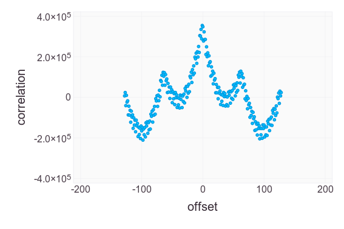

# 8 Bit Stupid

Analysis of an 8 bit version of the ["stupid"
cipher](http://news.quelsolaar.com/#comments101) as discussed on
[HN](https://news.ycombinator.com/item?id=6616438).

The cipher implementation can be seen in [Cipher.jl](src/Cipher.jl).

## Introduction

**Motivation** - it seems that the only way to learn about
implementing ciphers is to break them.  At the same time, the ciphers
that I know are ridiculously hard to break.  So breaking a "known bad"
design might be a good first step.

**Structure** - this page contains only a basic summary of the code
and results.  There are links to source files, which contain more
information in the comments.

**Language** - [Julia](http://julialang.org/) combines the speed of C
(or close) with the flexibility of Python and has ambitions to replace
statistical analysis packages like R.

**Why 8 bit?** - other stream ciphers (like Stupid) work with 8 bit
characters, so I can re-use any tools I develop.  In some ways it may
also simplify analysis (less state for a given key size, but for a
given sized state, less information is exposed when a character is
encrypted).  My aim is to learn about cipher analysis, not to "fix"
anyone's code.

## Plaintext Injection Attack

In some cases, injecting a pre-calculated fragment in the plaintext
can force the internal state of the cipher to a known point (excluding
the internal counter, which is known anyway).  Following text can then
be decypted directly.

A practical example is the encryption of a web page that displays
user-supplied data (like a name or comment).

The fragment is a counter (modulo 0xff) that mirrors the counter in
the cipher state.

For 3 byte keys, a 32 byte fragment affects 4% of keys.  For 4 byte
keys a longer fragment (120 bytes) is necessary to affect a similar
percentage.

Even when the known unique state is not achieved (including larger key
sizes), counter fragments *significantly* reduce the cipher state.  In
a random sample (size 100) of 8 byte keys encrypting a counter all had
state (excluding the internal counter) that repeated over unexpectedly
short periods.  The longest period was 319 characters and 43% achieved
stationary state (period 1) after 1500 characters or less.

The analysis can be seen in [Prefix.jl](src/Prefix.jl).

## Ciphertext Collisions

When [Little Brother](little-brother.txt) is encrypted with 100
distinct, random keys, of length 3 bytes, the endings of ~30% of the
files are not unique.

A pactical example is disk encryption, where the same file can be
identified for multiple users.

The analysis can be seen in [SelfEncrypt.jl](src/SelfEncrypt.jl).

## Distinguishing Attack

Ciphertext bitwise cross-correlated with a counter (modulo 0xff)
generally shows clear structure for 3 byte keys.  Typically a peak or
trough at ~0 offset with other features at 64 and 128 bytes offset.
Similar structures also appears to be visible (varying by key;
statistical significance unclear) with 8 byte keys.

A practical example is detecting the use of this (weak) cipher in data
of unknown origin.

Here is the correlation for [Little Brother](little-brother.txt),
encrypted with key 0xacb89d:

The analysis can be seen in [BitCorrelation.jl](src/BitCorrelation.jl).

## Copyright

Code copyright [Andrew Cooke](mailto:andrew@acooke.org) 2013, licensed
under the [GPLv3](LICENSE.md).

[Little Brother](little-brother.txt) copyright [Cory
Doctorow](mailto:doctorow@craphound.com), licensed under CC ANCS3 (see
file) (it's used as example English text for analysis, but it's
actually a great read - probably more interesting than this project).
