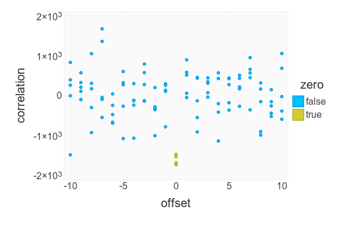

# The 8 Bit "Stupid" Cipher

An informal analysis of an 8 bit version of [this
cipher](http://news.quelsolaar.com/#comments101), as discussed on
[HN](https://news.ycombinator.com/item?id=6616438).

The cipher implementation can be seen in [Cipher.jl](src/Cipher.jl).

## Introduction

**Motivation** - it seems that the only way to learn about
implementing ciphers is to break them.  At the same time, the ciphers
that I know are ridiculously hard to break.  So breaking a "known bad"
design might be a good first step.

**Structure** - this page contains only a basic summary of the code
and results.  There are links to source files, which may contain more
information in the comments.

**Language** - [Julia](http://julialang.org/) combines the speed of C
(or close) with the flexibility of Python and has ambitions to replace
statistical analysis packages like R.

**Why 8 bit?** - other stream ciphers work with 8 bit characters, so I
can re-use any tools I develop.  In some ways it may also simplify
analysis (less state for a given key size, but for a given sized
state, less information is exposed when a character is encrypted).

## Statistics

All results below are for a plaintext size of 659408 bytes (the size
of the [Little Brother](little-brother.txt) text).  The tests used
Pearson's Chi-Squared test to assess whether bytes and bits were
uniformly distributed (bytes from 0 to 255; bits individually over 0
and 1).

Ciphertext is significantly different from random bytes when the
plaintext is constant (0x00, 0x55 or 0xff) for key lengths of 3 and 8
bytes.  The least significant bits are particularly unreliable.  16
byte keys give better output, but some keys are still problematic.

When encrypting random data the output does appear to be (consistent
with the hypothesis that it is) random, at all key sizes.

When encrypting text the data for 8 and 16 byte keys also appeared to
be random.

The analysis can be seen in [Statistics.jl](src/Statistics.jl).

## Plaintext Injection Attack

In some cases, injecting a pre-calculated fragment in the plaintext
can force the internal state of the cipher to a known point (excluding
the internal counter, which is known anyway).  Following text can then
be decrypted directly.

A practical example where this can be used is the encryption of a web
page that displays user-supplied data (like a name or comment).

The fragment is a counter (modulo 0xff) that mirrors the counter in
the cipher state.  The probable mechanism is a combination of the
counter plaintext canceling some (or all) counter bits and zeroing of
state when a byte is xored with a similar value.

For 3 byte keys, a 32 byte fragment affects 4% of keys.  For 4 byte
keys a longer fragment (120 bytes) is necessary to affect a similar
percentage.

Even when the known unique state is not achieved (including larger key
sizes), counter fragments *significantly* reduce the cipher state.  In
a random sample (size 100) of 8 byte keys encrypting a counter all had
state (excluding the internal counter) that repeated over unexpectedly
short periods.  The longest period was 319 characters and 43% achieved
stationary state (period 1) after 1500 characters or less.

The analysis can be seen in [Prefix.jl](src/Prefix.jl).

## Ciphertext Collisions (1)

When [Little Brother](little-brother.txt) is encrypted with 100
distinct, random keys, of length 3 bytes, the endings of ~30% of the
files are not unique.

A practical example where this can be used is against disk encryption,
where the same file can be identified for multiple users.

The probable mechanism is that initial state is slowly eroded by
similar-byte xor.

The analysis can be seen in [SelfEncrypt.jl](src/SelfEncrypt.jl).

## Distinguishing Attack

Ciphertext bitwise cross-correlated with a counter (modulo 0xff)
generally shows clear structure for 3 byte keys.  Typically a peak or
trough at ~0 offset with other features at 64 and 128 bytes offset.
Similar structures also appear to be visible (varying by key;
statistical significance unclear) with 8 byte keys.

A practical example where this can be used is detecting the use of
this (weak) cipher in data of unknown origin.

The probable mechanism is matching the internal counter.

Here is the correlation for [Little Brother](little-brother.txt),
encrypted with key 0xacb89d:

The analysis can be seen in [BitCorrelation.jl](src/BitCorrelation.jl).

## Statistical Plaintext Matching

There is a small but consistent bitwise (anti-)correlation between the
lowest two bits of plaintext and ciphertext for 8 byte keys at zero
offset.

A practical example where this can be used is when a user is suspected
of encrypting a particular document.

The probable mechanism is that these bits control permutation when key
length is a power of 2 (the calculation is modulo key length).

Here is the correlation for 5 random 8 byte keys, encrypting [Little
Brother](little-brother.txt), with the zero offset points marked in a
distinct colour.

The analysis can be seen in [BitCorrelation.jl](src/BitCorrelation.jl).

## Partial Known Plaintext Attack

If the initial character of the plaintext is known then the key space
is reduced by 8 bits.

A practical example where this can be used is when encrypting UTF-8
text, which has a known header.

The attack works because the ciphertext is xored with the plaintext
and the internal state; knowing the plaintext constrains the internal
state.

The analysis for 3 byte keys can be seen in
[BruteForce.jl](src/BruteForce.jl).

## Ciphertext Collisions (2)

Around 1% of 3 byte keys have siblings that give matching encryption
results.  For example, both 0x25730e and 0x92ef1c give the same
ciphertext for 100 random 16 byte strings.

This implies that the cipher is less secure than would be expected
from the key length.

I do not know the mechanism, but this may be related to the "missing
logic" in the code used in the partial plaintext attack (the routine
is less symmetric than expected because some combinations of pos
values cannot occur).

The analysis can be seen in [BruteForce.jl](src/BruteForce.jl).

## Copyright

Code copyright [Andrew Cooke](mailto:andrew@acooke.org) 2013, licensed
under the [GPLv3](LICENSE.md).

[Little Brother](little-brother.txt) copyright [Cory
Doctorow](mailto:doctorow@craphound.com), licensed under CC ANCS3 (see
file) (it's used as example English text for analysis, but it's
actually a great read - probably more interesting than this project).
